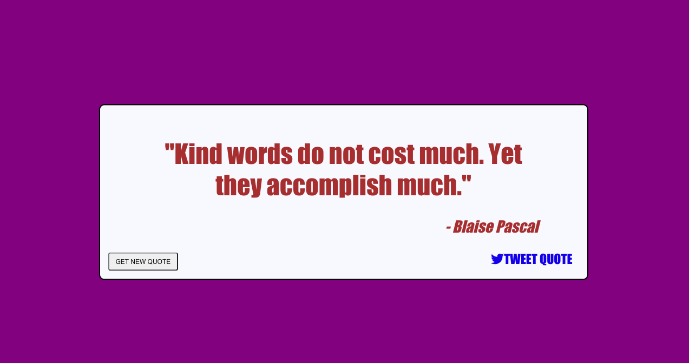

# Random Quote Machine (React.js)

My project for the [Build a Random Quote Machine challenge](https://learn.freecodecamp.org/front-end-libraries/front-end-libraries-projects/build-a-random-quote-machine) as part of the curriculum for the Front End Libraries Certification on [freeCodeCamp](https://www.freecodecamp.org). Built with React.js.

---

## Built With
* [React.js](https://reactjs.org)
* [Webpack](https://webpack.js.org)
* [EJS](https://ejs.co)
* [Font Awesome](https://fontawesome.com)
* [Google Fonts](https://fonts.google.com)

## Demo



## Installation

```
$ git clone
$ cd random-quote-machine-reactjs
$ npm install
$ npm start
```

Go to `http://localhost:3000`.
